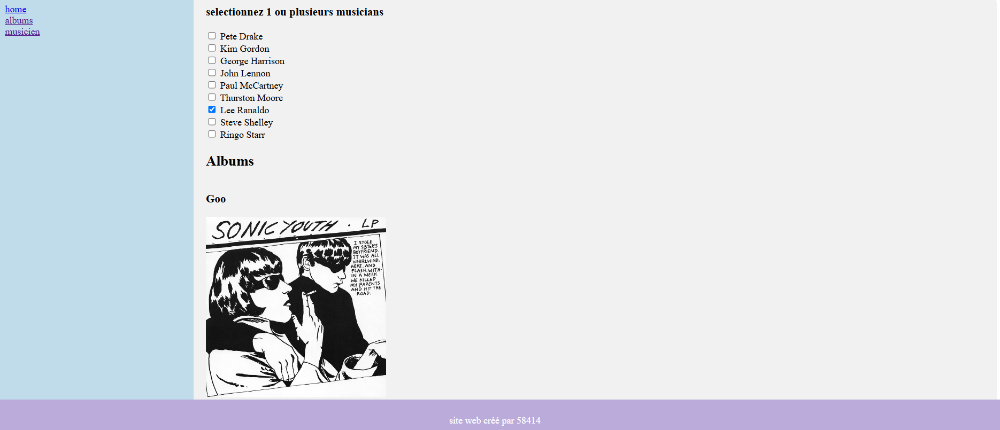

# Silly Music Website 🎶

Ce projet est un **site web simple** développé en **3 heures** dans un cadre d’entraînement. Il utilise **Laravel** comme framework principal et combine **PHP** et **JavaScript** pour une expérience interactive. Le but de ce projet était de s’exercer sur des concepts de base de développement web tout en créant une application ludique.

## Fonctionnalités principales ✨

1. **Accueil visuelle :** Une page d’accueil avec une capture d’écran disponible (`web.png`).
2. **Sélection de musiciens :** Une fonctionnalité permettant de choisir un musicien depuis une liste et d’afficher ses albums associés (`web2.png`).
3. **Architecture dynamique :** Utilisation de Laravel pour le backend et de JavaScript pour des interactions dynamiques sur la page.

## Technologies utilisées 🛠️

- **Framework :** Laravel 10.x
- **Langages :** PHP, JavaScript, HTML, CSS
- **Base de données :** MySQL (via **XAMPP**)
- **Front-end :** Blade (templating engine de Laravel), CSS basique
- **Serveur local :** Apache (via **XAMPP**)
- **Autres :** Composer pour la gestion des dépendances

## Utilisation 🖥️

Pour exécuter ce projet, il faut :

1. **XAMPP :**  
   - Activer **Apache** et **MySQL** dans le panneau de contrôle XAMPP.
   - Configurer la base de données MySQL si nécessaire (par exemple, pour gérer les musiciens et albums dynamiques dans une version future).

2. **Fichiers du projet :**  
   Placer le dossier du projet dans le répertoire `htdocs` de XAMPP.

3. **Accès au site :**  
   Ouvrir le site via [http://127.0.0.1:8000/](http://127.0.0.1:8000/) dans un navigateur localement.

## Structure du projet 🗂️

- **routes/web.php** : Définition des routes principales pour l’accueil et la sélection des musiciens.
- **resources/views/** : Contient les vues Blade utilisées pour les pages.

## Captures d’écran 📸

1. **Page d’accueil**  
   

2. **Page de sélection des musiciens et affichage des albums**  
   

## Limites et améliorations possibles ⚙️

- **Données statiques :** Actuellement, les données des musiciens et des albums sont codées en dur.
- **Interface utilisateur :** L'interface est basique et pourrait être améliorée avec des bibliothèques comme TailwindCSS ou Bootstrap.
- **Fonctionnalités supplémentaires :** Ajouter une base de données pour stocker dynamiquement les informations des musiciens et albums.

## Auteur ✍️

- **Aya**  

## Licence 📜

Ce projet est réalisé uniquement à des fins d’entraînement et n’est pas destiné à un usage commercial.

